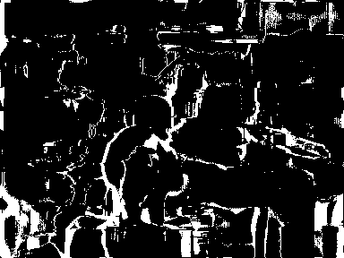
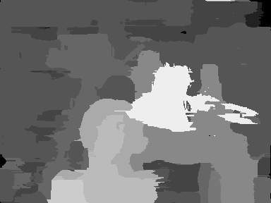
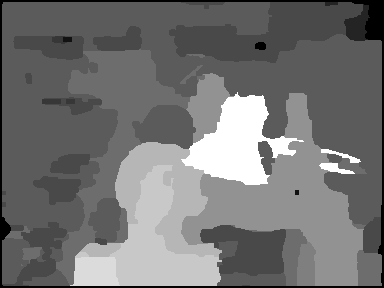
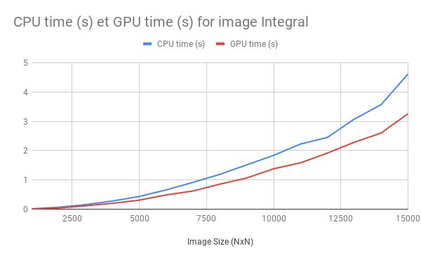
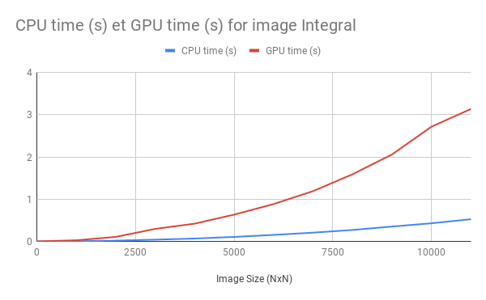
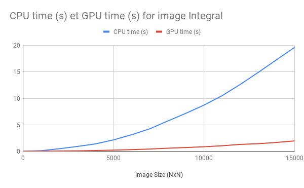

# INFOH503
Course project for ULB INFOH503 - Introduction to GPU Programming

This repository is the fruit of the work of 4 master students from the ULB.
It contains a crude implementation of an algorithm that computes a Stereo Disparity trough Cost Aggregation with Guided Filter described in Tan and Monasse in 2014.
This project was developed in the particular setup of the covid-19 pandemic and suffered many setbacks caused by diversity in the team IT background and by a stiff learning curved caused by OpenCL and it's multi-platform deployment.
At the end of the project, the team achieved intermediate skills with OpenCL, a working implementation of the Stereo Disparity and had a close look at the computation of an integral image.

## Setup

Dependencies of the projects are OpenCV and Opencl 1.2
The project is built using cmake;

## Warning :
All the results  with respect to the depth map have been measured using the image from the paper.

The interesting branches in this repository are:
- **Master** used to compute the performances of our implementation;
- **Benchmark scan** contains the implementations (CPU and GPU) of the integral used for the benchmark as well.
- **integral_image_guidedFilter** Proof Of Concept of integrating the integral image kernel into the guided filter  
## 1. Stereo Disparity
### 1.1 Paper implementation
First of all it is important to look at their implementation in order to speculate on the kind of acceleration we could expect. And when looking at it we of course find a well optimized implementation.

Notably:
- Filtering each layer as soon as it is generated.
- Once filtered  we update the disparity of each pixel for the final depth map;
- OpenMP is used for parallelization of occlusion filling.

But compared to our guided filter theirs use 3 channels. Where we only use 1 as we use a grayscale image. So we should be doing 2\*x\*y\*disparity less operations.

**maybe try on other small images?**
### 1.2 speed Up we could expect
We can divide their implementation in 4 parts :

|   |  run 1 |run 2|run 3 | average|
|---|---|---|---|---|
| LR depth map generation  |  0.273283 s |0.279657 s |0.2833 s |0.27874666 s |
| RL depth map generation |  0.273258 s |0.289527 s |0.282332 s |0.28170566 s |
| occlusion detection|  0.000444775 s|0.000443615 s |0.000458526 s |0.000448972 s |
| occlusion filling| 0.0907852 s|0.0911058 s |0.0902498 s |0.0907136 s |

We can notice that their implementation is consistent through the runs.

And Obviously we have different expectation regarding the different speed up we could achieve.

1.  Depth map

    The Depth map is computed in 4 step :

    1. Computing the cost of every pixel for each disparity

    2. Filtering each disparity layer

    3. Selecting the best disparity for every pixel

    For each of those steps we can expect a speedup by working on all the layers and all the pixels of each layer at the same time. Compared to the sequential implementation where. The bottleneck of our implementation should be the memory transfers.

2. Occlusion detection
      We should see a speed up for big images but on small images we should not get one. As it doesn't involve that much parallelization(thread) for small images. So the bigger the image the bigger the speedup compared to the sequential algorithm.

3. occlusion filling
    As they rely on openmp to do the filling we can't really expect that much of a speedup against their implementation.

### 1.3 actual speed up

|   |  Run 1 | Run 2| Run 3| Average |
|---|---|--- |--- |---|
| LR depth map generation  |   0.101171 s | 0.109507 s| 0.106023 s| 0.105567 s|
| RL depth map generation |  0.115929 s | 0.109131 s| 0.0984433 s| 0.1078344 s|
| occlusion detection|  0.0004026 s| 0.0005632 s| 0.0002664 s| 0.0004107 s|
| occlusion filling| 0.0016828 s| 0.0018479 s| 0.0021746 s| 0.0019017 s|

First of all we direcly notice that our runs are far less consistent than the paper implementation.

|   |  GPU average| CPU average| Speed Up|
|---|---|--- |--- |
| LR depth map generation  |   0.105567 s | 0.27874666 s|2.64x |
| RL depth map generation |  0.1078344 s | 0.28170566 s| 2.61x|
| occlusion detection|  0.0004107 s| 0.000448972 s| 1.09x|
| occlusion filling| 0.0019017 s| 0.0907136 s| 47x|
|Total   |0.2157138 s|0.651614892| 3.02x|

The most versatile component is the occlusion detection that sometimes gives us a 2x acceleration and sometimes is a fourth slower. Note also that LR depth map generation and RL depth map generation are the same procedure.

As expected we have speed ups on the integral image generation. Not as much as we would have expected. The slow downs are probably partly due to:
 - We don't use local memories
 - We use four kernels to achieve this task : Cost volume, guidedfilterStart, guidedfilterEnd, disparity selection. This leads to a lot of data transfer inbetween device and host.
 - The image used is small

The occlusion detection has the smallest speedup. probably because it is such a small task on a small image.

And finaly the occlusion filling which as unexpected as it is has the biggest speed up.

### 1.4 Resulting images
**Occlusion detection**

**Occlusion filling (without median filter)**

**Occlusion filling (with median filter)**

### 1.5 To go further
What we would have liked to implement in order to have a real gain of speed compared to the sequential implementation are:
- Use of local memory
- Handle images that are bigger than the available memory
- Resolve the banking conflicts
- Use properly the integral image for the guided filter
- Computer the filtering in one step instead of 2.

## 2. Integral Image

Computing the integral image of a matrix is a essential step of the process studied.
It has many reference documents;

- [Nvidia guide to Scan](https://developer.nvidia.com/gpugems/gpugems3/part-vi-gpu-computing/chapter-39-parallel-prefix-sum-scan-cuda)
- [IEE symposium extract: Efficient Integral Image Computation](https://www.researchgate.net/publication/224167113_Efficient_Integral_Image_Computation_on_the_GPU)

Our implementation follow the second document and explore the case of having the number of blocs per row exceeding the size of a bloc.
In this situation the algorithm must be called recursively.

### Algorithm in short.

The algorithm is composed of 3 kernels;

- Bloc Scan (S)
- Transpose
- Inter-Block synchronisation.(IB)

Because S & IB are both row-based process the kernels are enqueued so that a finite number of block is mapped to each row.
The choice was made to avoid padding meaning that each global memory access are conditioned to a check on the thread index.

Scan is the most complex kernel, it use a local buffer to perform a dyadic sum and store the bloc sum into a separate global memory for further operations.
Each kernel perform 2 float reading&writing operation in the global memory becaused it proved difficult to transfer opencv matrix to device memory encoded in float2 using the version of the libraries that worked on all our platforms.
It is expected to have bank conflict that may be avoided by further work on the kernel.

### State of the work

Our current implementation do not run as is on all of our platform with some difficulties identified to trust the bloc size given by the opencl interface.
Additionally at the of the work the introduction of ocl-grinder there has been some bad memory access identified on the scan kernel.
But tools usage was not generalized to all platforms to difficulty of installation leading to no further development of this issue.

Between platforms the resulting algorithm have widely different performance when compared to CPU as shown by the 3 following graphs.
Because it was expected to be used on float the benchmark involved only float matrix.
The GPU performance are relatively the same with a performance for a 11k x 11k matrix above 3sec.

**Platform 1**

**Platform 2**

**Platform 3**

## 3. SetBacks & Trivia

In no specific order the following events were cause for significant delay:

- Setup Opencv & OpenCL on windows
- Backtracking from learning the C++ Opencl interface due to hardware incompatibility
- Inverting left and right Stereo Image
- Kernel does not launch but error code is not mapped in documentation
- Writing a function that print the kernel compilation errors
- Difficulties in knowledge and code-related information spreading due to lockdown leading to several avoidable and hard to spot bugs
- Working only with integrated GPU necessitating added complexity due to small block size (256)
- Code behavior variation between platforms making bug harder to spot.
- Memory leaks

Some important notes:

- Commits history displayed in the repository do not reflect each authors participation due to unequal git and C++ prior experience.
- It is best if a linux distribution is used to compile the code, it can be tricky on windows to setup the dependencies.
